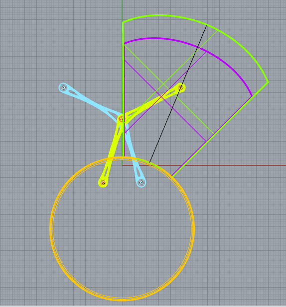
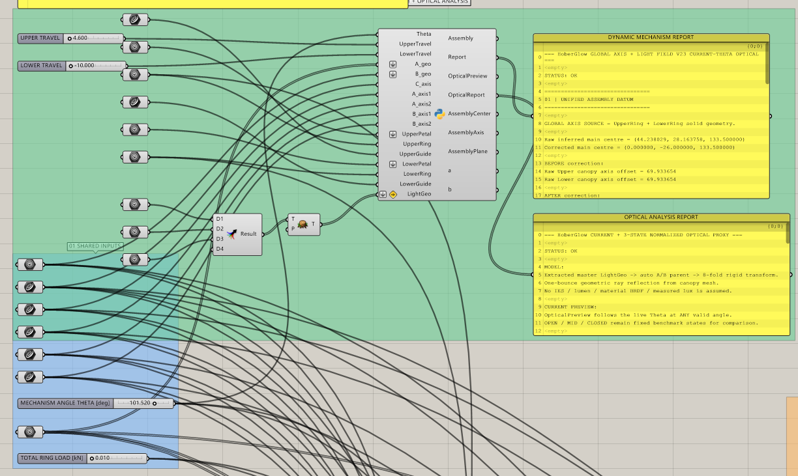
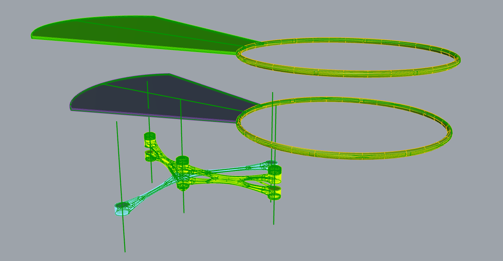
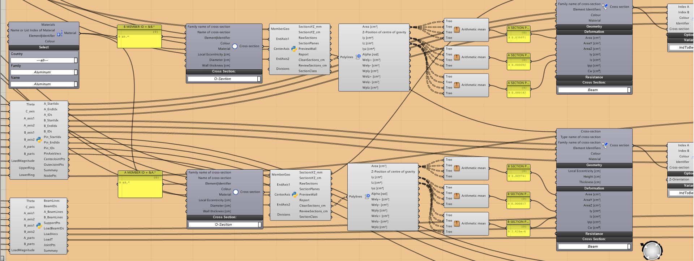

# HoberGlow — Parametric Kinetic Mechanism, Optics and FEA

HoberGlow is a Rhino/Grasshopper research prototype for a transformable kinetic
lighting system. This repository demonstrates three connected workflows:

- a scissor-based dynamic mechanism;
- a lightweight optical preview and report;
- a Karamba3D 1/8 cyclic-sector structural proxy with five active elements.

## Important intellectual-property notice

> **The original product appearance and production 3D model were purchased by
> the sponsoring company and are not included in this repository.**

The public Grasshopper definition contains the independently developed
parametric workflow, named input interfaces, motion logic, optical analysis and
reduced structural-analysis chain. All referenced product geometry has been
removed from the public file.

You are welcome to study the workflow and bind **your own skeleton or product
geometry** to the named Grasshopper inputs. This repository does not grant any
rights to the company's proprietary product design or production model.

## What is included

- `grasshopper/HoberGlow_Public_Framework.ghx` — English-labelled public
  definition with proprietary geometry references cleared.
- `assets/` — documentation screenshots only; these are not downloadable CAD
  assets and cannot be reconstructed into the production model.
- `LICENSE.md` — limited permission for the author-owned framework and an
  explicit exclusion for company-owned assets.

The original binary `.gh` file is intentionally not published because it cannot
be independently audited and sanitized here as reliably as the text-based
`.ghx` archive.

## Bind your own geometry

Open the GHX in Rhino 8 / Grasshopper, then set the following named inputs from
your own Rhino document:

| Input group | Required named inputs |
|---|---|
| Mechanism members | `A PARTS INPUT`, `B PARTS INPUT` |
| Motion axes | `CENTER AXIS INPUT`, `A AXIS 1 INPUT`, `A AXIS 2 INPUT`, `B AXIS 1 INPUT`, `B AXIS 2 INPUT` |
| Upper assembly | `UPPER PETAL INPUT`, `UPPER RING INPUT`, `UPPER GUIDE INPUT` |
| Lower assembly | `LOWER PETAL INPUT`, `LOWER RING INPUT`, `LOWER GUIDE INPUT` |
| Optical geometry | `LIGHT GEOMETRY 1`, `LIGHT GEOMETRY 2`, `LIGHT GEOMETRY 3` |

After binding the geometry, adjust:

- `MECHANISM ANGLE THETA [deg]`
- `UPPER TRAVEL`
- `LOWER TRAVEL`
- `TOTAL RING LOAD [kN]`

## Read the outputs

### Dynamic mechanism

- `Assembly` — live transformed geometry in the Rhino viewport.
- `DYNAMIC MECHANISM REPORT` — axis, datum and transformation diagnostics.

### Optical analysis

- `OpticalPreview` — live rays/cones in the Rhino viewport.
- `OPTICAL ANALYSIS REPORT` — current optical-state summary.

### Structural proxy

- `Maximum Displacement [cm]`
- `Maximum Resultant Force [kN]`
- `Sum of Reaction Forces [kN]`
- `Elastic Energy Change [kNm]`
- member maxima: `N`, `Vy`, `Vz`, `Mt`, `My`, `Mz`

## Dependencies

- Rhino 8
- Grasshopper
- Karamba3D
- Rhino 8 Python 3 Script component

If Karamba3D displays translated port captions, choose:

`Karamba3D menu → Set Language for Components → English`

Then recompute or reopen the definition.

## Structural-analysis limitation

The public structural branch is a **five-element reduced-order proxy** designed
to remain below Karamba3D's 20-beam trial limit. It represents one eighth of the
eight-sector mechanism and assumes cyclic symmetry. It is suitable for workflow
demonstration and relative comparisons, not final structural certification.

## Authorship and project context

HoberGlow began as an industry-sponsored team design project. The
Grasshopper-based kinematics, optical-analysis workflow and reduced Karamba3D
study presented here were developed later as an independent computational
design investigation by Shuofei Zan.

The project was submitted to the Red Dot Award; it did not receive an award.
